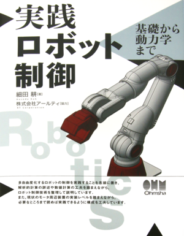

# Robot Manipulation in TypeScript🤖

This repository is an implementation of the book "[実践ロボット制御](https://www.amazon.co.jp/dp/4274224309)" in TypeScript from scratch.



## Requiements

You can use [VSCode devcontainer](https://code.visualstudio.com/docs/remote/containers) of whole required environment.

* Deno ~1.1

## Test

```sh
$ deno test src/
```
